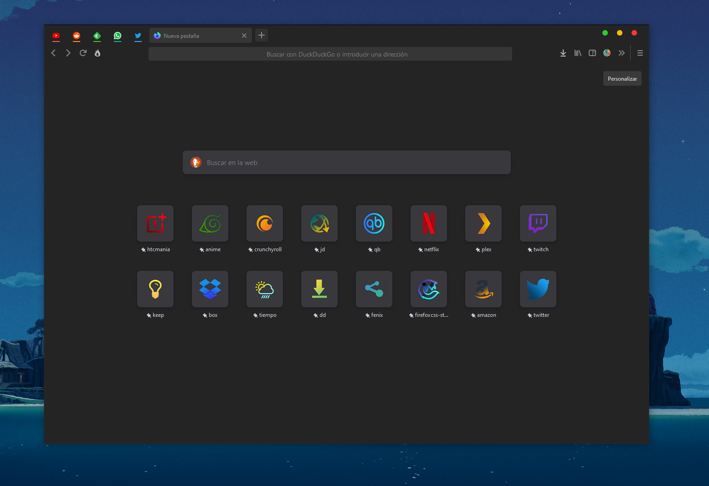

# Almost Dark Grey/Colorfull Proton


This is a simple fork all credits to https://github.com/CristianDragos/FirefoxThemes and https://github.com/datguypiko/Firefox-Mod-Blur

# How to download and install
1. [Click here to download](https://github.com/Neikon/Almost-Dark-Grey-Colorfull-Proton---FirefoxCSS-Themes/releases) or Click in `Releases` on the right side of this page.
2. Open a new tab in firefox and write in url bar `about:support` you should see a list with your firefox data, You only need **"Profile folder"** , you can now click in "Open folder" button o copy the address to your profile folder.
    the address should be similar to following example depend of your system:
    + Linux - `$HOME/.mozilla/firefox/XXXXXXX.default-XXXXXX/`
	+ Windows 10 - `C:\Users\<USERNAME>\AppData\Roaming\Mozilla\Firefox\Profiles\XXX.default-XXX`
	+ macOS - `Users/<USERNAME>/Library/Application Support/Firefox/Profiles/XXXXXXX.default-XXXXXXX`
3. Go to that folder.
4. if there is no folder called `chrome`. Create it.
5. Extract the contents of the zip file you downloaded in the first step into the folder `chrome`
    + it should look something like this: 
    ```
    chrome/
          |- useschrome.css
          |- useContent.css
          |- image/
    ```
6. Now go to firefox open a new tab and write `about:config` in the url bar
7. A dialog will warn you, but ignore it, just do it press the `I accept the risk!` button.
8. Search this `toolkit.legacyUserProfileCustomizations.stylesheets` and set to **true**.
9. Restart Firefox
10. That's all, after restarting you should be seeing your new topic

**If you see any things in white maybe you need to activate dark colors in firefox**
 + Go to Firefox 3 lines menu -> Customize
 + At the bottom of the page there is a button called `themes` click it and set to `Dark`

# Color underline in pinned tab
+ Those tabs are simply in a container and I have adjusted the colors of those containers to match.

# A simple or complementary versions of theme. (Choose only one of the options below)
+ [Click here to see this theme as standar firefox theme](https://addons.mozilla.org/es/firefox/addon/almost-dark-proton/)
+ [Click here to see Firefox color version](https://color.firefox.com/?theme=XQAAAAIDBAAAAAAAAABBKYhm849SCicxcUapi38oKRicm6da8pG5gjJb-G_pjPXQAkFXTZounwBsJxx0SrOzT7tu4xqlg59IWzEQl19rU_THuaU5NMCRHVgRdZ4FokWwvLRzUDj_kU6oP0t2qTl9Y9w8LnJ_HIeeBQNFViuLYPUqvxM5e29ewwY9emkRgUXHd-8ZDhZxjC6YMT0poIWDgH6plF6RkLXb3PrhBUK5E1rzuMVlDRK2Ev2Iap6fvmuIOSU4_Cyp0o5szlba69TXYSDs7BTsYliddWsU9j9w29agrg6IPKQzxQp5-4jedJu38-pFJkCPjMqrc5MBLnTKGcozjGq5vu6EoXVeqAiX_9Tpquzom0fFcZ6WQxXPByBzR7ouiDZ0cBeJUQeriNpilnV77FMdahFrIPbzkg3OCSuSYQDKeslIuu_INEY_tCz0dwBoJSmWS5JN6Fxk2gLtsKOG0LXGA-fTeMNCVwcDi6esp4gMa91p3MYy4SRNX__wsgV5) This version is identical to the standard Firefox theme, but you can easily edit all the colors. You will need Firefox Color addon to install it.


# Newtab page *Not necessary as of firefox 89 *
1. enable this in `about:config` -> `browser.newtabpage.activity-stream.newNewtabExperience.enabled` to make newtab looks like preview picture.

# Other proton entries that maybe you like it (optionals) *Not necessary as of firefox 89 *
1. `browser.proton.enabled`
2. `browser.proton.tabs.enabled`
3. `browser.proton.appmenu.enabled`


